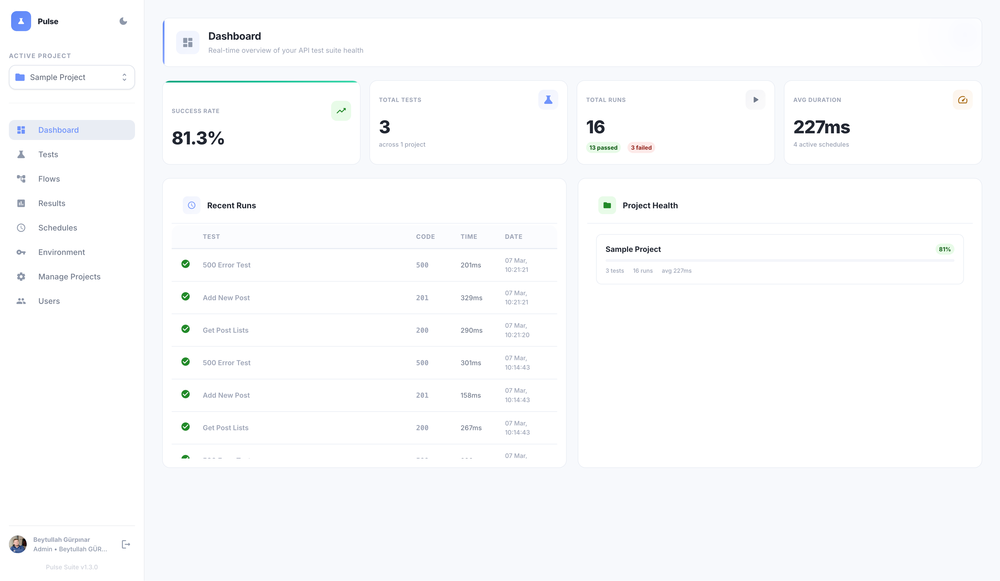
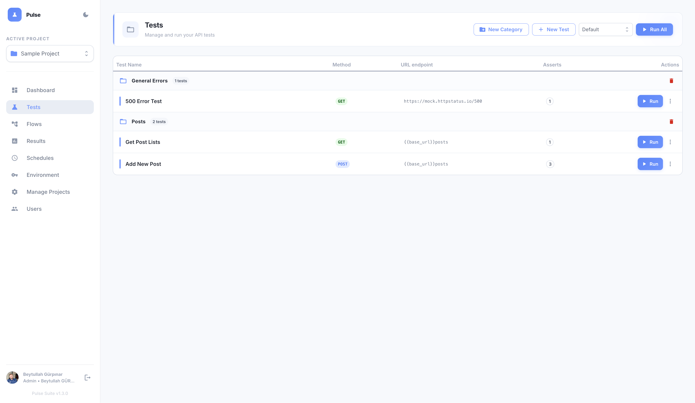
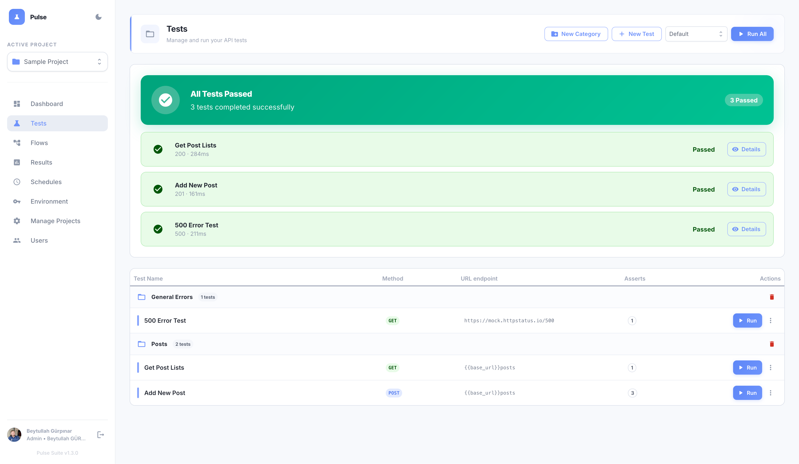
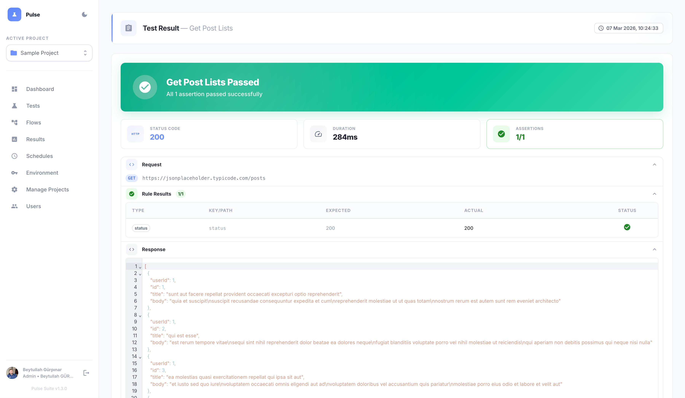
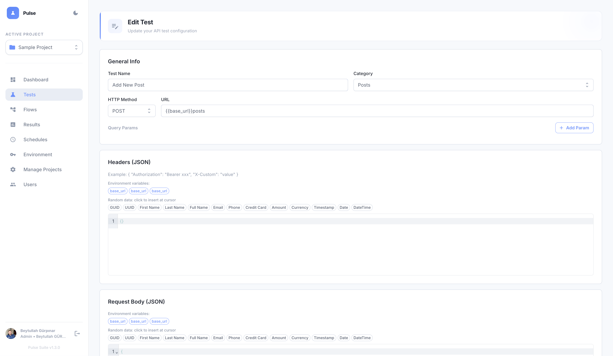
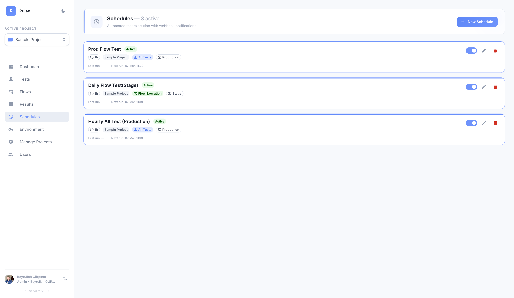
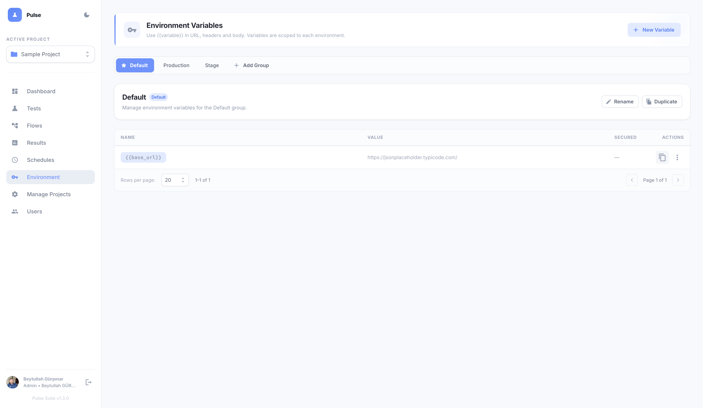

<div align="center">
  
  <h1>Pulse Test Suite</h1>
  <p><b>Professional API Testing, Monitoring & AI-Native Workflow Platform.</b></p>
  <p>
    <a href="#-key-features">Features</a> •
    <a href="#-mcp--ai-integration">MCP / AI</a> •
    <a href="#-getting-started">Getting Started</a> •
    <a href="#-tech-stack">Tech Stack</a>
  </p>
</div>

**Pulse Test Suite** is a self-hostable API testing and monitoring platform for teams that need automated assertions, multi-step flow orchestration, scheduled monitoring, and first-class AI integration via the Model Context Protocol (MCP).

---

## Overview

<div align="center">
  
  
</div>
<br>
<div align="center">
  
  
</div>
<br>
<div align="center">
  
  
</div>

---

## Key Features

### 1. Intelligent Test Creation
Define API requests with precision:
- **Environment Variables**: Use `{{variable}}` in URLs, headers, body, and assertions. Variables are scoped per environment (Development, Staging, Production).
- **Mock Data Injection**: Built-in placeholders auto-generate random values at runtime — `{{guid}}`, `{{email}}`, `{{timestamp}}`, `{{name}}`, `{{phone}}`, etc.
- **Full HTTP Method Support**: GET, POST, PUT, PATCH, DELETE, HEAD, OPTIONS.
- **Retry on Failure**: Configure per-test retry count (1×, 2×, 3×). Failed tests are automatically re-run before being marked failed — useful for flaky networks or rate-limited endpoints.

### 2. Advanced Assertion Engine
Validate every dimension of your API responses:

| Type | What it checks | Example |
|---|---|---|
| **HTTP Status** | Response status code | `200`, `404` |
| **JSON Path** | Any field in the response body | `data.token` equals `{{TOKEN}}` |
| **Response Time** | End-to-end latency | `< 500ms` |
| **Response Header** | Any response header | `Content-Type` contains `application/json` |
| **JSON Schema** | Full response structure validation | Draft 7 schema |

Supported JSON Path operators: `eq`, `ne`, `contains`, `exists`, `not_exists`, `is_null`, `is_not_null`, `is_true`, `is_false`.

Use `{{VAR_NAME}}` in any expected value to reference environment variables or values extracted from earlier flow steps.

### 3. Workflow Orchestration (Flows)
Test complete business scenarios, not just individual endpoints:
- **Chained Requests**: Execute API calls in a strict sequence.
- **Data Extraction & Pipelining**: Capture values from one response (e.g., `access_token`, `transaction_id`) via JSONPath and inject them into subsequent steps — URLs, headers, body, and assertions.
- **Fail Fast**: Flow stops immediately if any step fails.
- **Step Ordering**: Reorder steps with up/down controls.
- **Nested Category Browsing**: The test picker shows full category paths (`Auth / OAuth / Social`) for easy navigation in large projects.

### 4. Scheduled Monitoring
Turn your tests into a proactive monitoring system:
- **Periodic Runs**: Schedule individual tests, all project tests, or entire flows to run at configurable intervals (5 min, hourly, daily, etc.).
- **Environment Targeting**: Run schedules explicitly against Staging, Production, or any custom environment.
- **Webhook Notifications**: Get notified via Slack, Teams, or any webhook when a job passes or fails. Configurable per schedule.

### 5. Security & Encryption
- **AES-256-GCM Encryption**: All sensitive values (secured env vars, request/response snapshots) are encrypted at rest in the database.
- **PCI Data Masking**: Card numbers, CVVs, and other PCI-sensitive patterns are automatically detected and masked in request/response logs — they never reach the database in plain text.
- **Secured Variables**: Secrets stored as env vars are displayed as `secret:***` in all UI panels, logs, and reports. The raw value is never transmitted to the frontend.
- **SSRF Protection**: Requests to private IP ranges (`127.x`, `10.x`, `192.168.x`, `169.254.x`, cloud metadata endpoints) are blocked at the runner level.

### 6. Test Organization
- **Nested Categories**: Hierarchical folder trees with unlimited depth.
- **Collapsible Tree View**: Expand/collapse folders; collapsed folders show the test count inside.
- **Instant Search**: Search by name, method, or URL — switches to a flat result view automatically.
- **Import from Postman & OpenAPI**: Paste a Postman Collection v2.x JSON or OpenAPI 3.x / Swagger 2.x YAML/JSON. Pulse previews what will be imported, then creates tests, categories, and folder structures in one click. Re-importing is safe — existing tests are updated, not duplicated.

### 7. Multi-Tenancy & User Management
- **Workspaces**: Full tenant isolation — each workspace has its own projects, tests, environments, and run history.
- **Google OAuth**: Sign in with Google. The first user to log in claims the Admin role for the workspace.
- **Roles**: `admin` (full access, user management) and `editor` (create/run/edit tests).
- **Invitation System**: Admins invite team members by email. Invite links are single-use and role-scoped.

### 8. Dashboard & Analytics
- **Success Rates**: Monitor health across all projects at a glance.
- **Performance Trends**: Track average response times.
- **Live History**: Searchable log of every manual and scheduled run with full request/response snapshots.

---

## MCP / AI Integration

Pulse includes a native **Model Context Protocol (MCP)** server that lets Claude (or any MCP-compatible AI tool) run your tests and flows directly from the editor — no browser needed.

### How it works

1. Create a project-scoped **MCP Key** in the web UI under **Project → MCP Keys**.
   Each key is optionally bound to a specific environment.
2. Start the MCP server with that key:
   ```bash
   MCP_KEY=zts_yourkey ./zotlo-mcp
   ```
3. The server authenticates the key, resolves the project and environment automatically, and exposes the tools below to Claude.

### Available MCP Tools

| Tool | Description |
|---|---|
| `list_tests` | List all tests in the project |
| `run_test` | Run a specific test by ID, returns result immediately |
| `run_all_tests` | Run every test in the project, returns pass/fail summary |
| `list_flows` | List all flows in the project |
| `run_flow` | Run a flow step-by-step, returns per-step results |
| `create_test` | Create a new test with headers, body, and assertions |

### Creating Tests via MCP

Claude can create new tests dynamically with the `create_test` tool:

```
create_test:
  name: "Get User Profile"
  method: "GET"
  url: "https://api.example.com/users/1"
  headers: '{"Authorization": "Bearer {{token}}"}'
  assertions: '[{"type":"status","operator":"eq","expectedValue":"200"},{"type":"json_path","key":"data.id","operator":"exists"}]'
```

**Assertion types:**

| `type` | `key` | `operator` | `expectedValue` |
|---|---|---|---|
| `status` | — | `eq`, `ne` | `"200"` |
| `json_path` | `data.token` | `eq`, `ne`, `contains`, `exists` | any value |
| `json_equals` | — | — | full JSON body |

### MCP Key Security
- Keys are in the format `zts_<40 hex chars>`.
- Only the SHA-256 hash is stored in the database — the full key is shown **once** at creation time.
- Keys can be **rotated** at any time (old key is immediately invalidated) or **deleted**.
- Each key records its `lastUsedAt` timestamp.

### Register with Claude Code
```bash
claude mcp add zotlo-test-suite /path/to/zotlo-mcp
```

Or edit `~/.claude.json` to add an env var:
```json
{
  "mcpServers": {
    "zotlo-test-suite": {
      "command": "/path/to/zotlo-mcp",
      "env": { "MCP_KEY": "zts_yourkey" }
    }
  }
}
```

### Build the MCP binary
```bash
go build -o zotlo-mcp ./cmd/mcp
```

Rebuild whenever you update the server.

---

## Getting Started

Pulse is self-hostable and ships as a single Docker Compose stack.

### Quick Start with Docker

```bash
git clone https://github.com/beytullahgurpinar/pulse-test-suite.git
cd pulse-test-suite

# Optional: configure environment
cp .env.example .env

# Start the full stack (backend + frontend + MySQL)
docker-compose up -d --build
```

App is now live at **http://localhost:8181**.

The first user to sign in with Google claims the Admin role for the workspace.

### Run locally (development)

**Backend:**
```bash
cp .env.example .env   # set your DB credentials and keys
go run ./cmd/server
```

**Frontend:**
```bash
cd frontend
npm install
npm run dev
```

Frontend runs on `http://localhost:5173`, proxying API calls to `:8181`.

---

## Environment Variables

| Variable | Default | Description |
|---|---|---|
| `MYSQL_HOST` | `localhost` | MySQL host |
| `MYSQL_PORT` | `3306` | MySQL port |
| `MYSQL_USER` | `root` | MySQL user |
| `MYSQL_PASSWORD` | `password` | MySQL password |
| `MYSQL_DATABASE` | `pulse_db` | Database name |
| `PORT` | `8181` | HTTP server port |
| `ENCRYPTION_KEY` | *(dev fallback)* | AES key for encrypting secrets — **change in production** |
| `JWT_SECRET` | *(same as ENCRYPTION_KEY)* | Secret for signing JWT tokens |
| `GOOGLE_CLIENT_ID` | — | Google OAuth client ID |
| `GOOGLE_CLIENT_SECRET` | — | Google OAuth client secret |
| `APP_URL` | `http://localhost:8181` | Public base URL (used for OAuth callback) |

---

## Tech Stack

| Layer | Technology |
|---|---|
| Backend | Go — Gin, GORM |
| Frontend | React 18 + TypeScript + Vite |
| Design System | MUI Joy UI |
| Database | MySQL 8.0 |
| AI Integration | Model Context Protocol (MCP) — `mark3labs/mcp-go` |
| Auth | Google OAuth 2.0 + JWT |

---

## License

Licensed under the **MIT License + Commons Clause 1.0**.

Free for individuals, students, and internal company use. The Commons Clause prohibits selling this software or offering it as a hosted SaaS product where the software itself is the primary value.

See [LICENSE](LICENSE) for the full text.

---

<div align="center">
  <i>Developed by <b>Beytullah Gürpınar</b></i>
</div>
